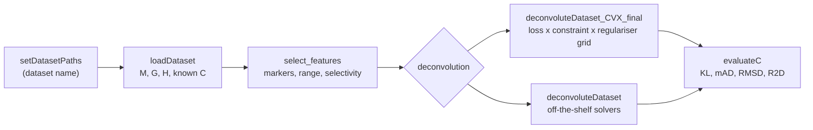

# DeconvolutionReview

**Reference implementation and benchmark harness for a critical survey of gene
expression deconvolution.**

Bulk expression profiles measure a mixture of cell types, not a single one.
*Deconvolution* recovers the proportions of each constituent type, and often
their type-specific profiles, from that mixture. Formally, given a mixture matrix
`M` (genes x samples) and a reference signature matrix `G` (genes x cell types),
we solve for the concentration matrix `C` (cell types x samples) in

```
M ~ G * C
```

Most published deconvolution methods are a particular set of choices inside that
one equation: which loss function measures the residual, which constraints `C`
must satisfy, whether the data are normalised, which features are used, and
whether the solution is regularised. This repository holds the code behind a
survey that isolates each of those choices and measures its effect independently,
across ten benchmark datasets.

## What the code varies

| Axis | Options implemented |
| --- | --- |
| **Loss function** | `L2` (least squares), `L1` (least absolute deviation), `Huber`, `Hinge` (support vector regression) |
| **Constraints** | Non-negativity (`NN`), sum-to-one (`STO`), either, both, or neither |
| **Normalisation** | None, mixtures only (`M`), references only (`G`), or both |
| **Regularisation** | None, `L1`, `L2`, elastic net, with tunable `lambda1` / `lambda2` |
| **Feature selection** | Marker selection, expression-range filtering, adaptive range filtering, selectivity and fold-change filters, condition-number-guided cuts |
| **Off-the-shelf solvers** | `LS`, `NNLS`, `QP`, `nnlsm_blockpivot`, `nnlsm_activeset`, `largennls`, `lsqnonnegvect`, and three SVR variants |

Four evaluation measures are reported per run: Kullback-Leibler divergence, mean
absolute deviation, root mean squared deviation, and a rank-based agreement score.

## Pipeline



## Requirements

| Dependency | Purpose |
| --- | --- |
| MATLAB R2014b or newer | The code uses `inputParser`, `readtable`, and `table` |
| [CVX](https://cvxr.com/cvx/) | Required by `deconvoluteDataset_CVX_final`, which formulates each loss and regulariser as a disciplined convex program |
| Optimization Toolbox | `lsqlin` and `lsqnonneg`, used by the `QP` and `NNLS` paths |
| Statistics and Machine Learning Toolbox | `ttest2` and `fitrsvm` for the selectivity filter and SVR paths |

GNU Octave is not sufficient here: CVX and the MATLAB solver toolboxes have no
Octave equivalent in this codebase.

## Install

```bash
git clone https://github.com/shmohammadi86/DeconvolutionReview.git
cd DeconvolutionReview
```

In MATLAB:

```matlab
addpath(genpath('code'))
cvx_setup        % once, after installing CVX
```

## Data

The benchmark datasets **are bundled**, under `input/`. Seven of the nine
datasets used in the survey ship with the repository, with their mixtures,
reference signatures, pure profiles, annotations, and ground-truth proportions:

| Dataset name | Folder | GEO accession | Tissue |
| --- | --- | --- | --- |
| `LiverBrainLung` | `LiverBrainLung_GSE19830` | [GSE19830](https://www.ncbi.nlm.nih.gov/geo/query/acc.cgi?acc=GSE19830) | Rat liver, brain, lung mixtures |
| `BreastBlood` | `BreastBlood_GSE29832` | [GSE29832](https://www.ncbi.nlm.nih.gov/geo/query/acc.cgi?acc=GSE29832) | Breast tissue and blood |
| `CellLines`, `CellLines_minimal` | `CellLines_GSE11058` | [GSE11058](https://www.ncbi.nlm.nih.gov/geo/query/acc.cgi?acc=GSE11058) | Immune cell lines |
| `RatBrain` | `RatBrain_GSE19380` | [GSE19380](https://www.ncbi.nlm.nih.gov/geo/query/acc.cgi?acc=GSE19380) | Rat brain cell types |
| `Retina` | `Retina_GSE33076` | [GSE33076](https://www.ncbi.nlm.nih.gov/geo/query/acc.cgi?acc=GSE33076) | Mouse retina |
| `PERT_Cultured` | `PERT_Cultured_GSE16589` | [GSE16589](https://www.ncbi.nlm.nih.gov/geo/query/acc.cgi?acc=GSE16589) | Cultured haematopoietic cells |
| `PERT_Uncultured` | `PERT_uncultured_GSE40830` | [GSE40830](https://www.ncbi.nlm.nih.gov/geo/query/acc.cgi?acc=GSE40830) | Uncultured haematopoietic cells |

Two datasets referenced by `setDatasetPaths.m` are **not** included and must be
obtained separately if you want them:

| Dataset name | Expected folder | Source |
| --- | --- | --- |
| `MAQC` | `MAQC_GSE5350` | [GSE5350](https://www.ncbi.nlm.nih.gov/geo/query/acc.cgi?acc=GSE5350), the MAQC reference RNA titration |
| `PBMC_LM22` | `PBMC_Alizadeh` | The LM22 signature matrix of Newman, Alizadeh *et al.* |

The bundled data is about 163 MB and is stored with
[Git LFS](https://git-lfs.com), so **install Git LFS before cloning**:

```bash
# Debian / Ubuntu
sudo apt-get install git-lfs
# macOS
brew install git-lfs

git lfs install
git clone https://github.com/shmohammadi86/DeconvolutionReview.git
```

Without Git LFS the files under `input/` arrive as small text pointers rather
than data, and `loadDataset` will fail to parse them. If you have already cloned
that way, run `git lfs install && git lfs pull` in the clone to fetch the real
content. `git clone --depth 1` avoids downloading the history.

See [`input/README.md`](input/README.md) for the file format and the layout a
new dataset must follow.

## Quick start

```matlab
addpath(genpath('code'))

paths = setDatasetPaths('CellLines');
[M, G, annotations, known_C, H] = loadDataset(paths);

% Restrict to informative markers
features = select_features(H, M, annotations, 'CellLines', ...
                           'filter_range', true, 'filter_selectivity', true);
M = M(features, :);
G = G(features, :);

% Least squares with an explicit non-negativity constraint
C_hat = deconvoluteDataset_CVX_final(M, G, 'loss_fun', 'L2', 'NN', true, 'STO', false);

[KL, mAD, RMSD, R2D] = evaluateC(known_C, C_hat);
fprintf('KL = %.4f  mAD = %.4f  RMSD = %.4f\n', KL, mAD, RMSD);
```

To reproduce the survey's loss and constraint comparison across datasets, use
the `run_benchmark` driver:

```matlab
results = run_benchmark({'CellLines', 'Retina'}, {'L2', 'L1'}, 'results.tsv');
```

Or sweep by hand:

```matlab
for loss = {'L2', 'L1', 'Huber', 'Hinge'}
  for sto = [false true]
    C_hat = deconvoluteDataset_CVX_final(M, G, 'loss_fun', loss{1}, ...
                                         'NN', true, 'STO', sto);
    [KL, mAD, RMSD] = evaluateC(known_C, C_hat);
    fprintf('%-6s STO=%d  KL=%.4f  mAD=%.4f  RMSD=%.4f\n', ...
            loss{1}, sto, KL, mAD, RMSD);
  end
end
```

## Function reference

| Function | Purpose |
| --- | --- |
| `setDatasetPaths` | Maps a dataset name to its expression, annotation, and ground-truth files |
| `loadDataset` | Reads `M`, `G`, `H`, annotations, and known proportions; intersects features and reverses accidental log transforms |
| `select_features` | Marker and feature selection: range, selectivity, fold change, uniformity, and condition-number criteria |
| `adaptiveRangeFiltering` | Data-driven expression-range cuts, as opposed to fixed thresholds |
| `prune_relative_ranges` | Removes features violating the similar-cell-quantity assumption |
| `compute_W` | Builds the residual weighting matrix used by the weighted losses |
| `deconvoluteDataset_CVX_final` | The survey's main engine: loss x constraint x normalisation x regulariser |
| `deconvoluteDataset` | Off-the-shelf solvers, for comparison against the CVX formulations |
| `evaluateC` | KL divergence, mean absolute deviation, RMSD, and rank agreement |
| `evaluateC_pval` | Permutation-based significance for the same measures |

Vendored third-party utilities live under `code/utils/`: block-pivot and
active-set NNLS solvers, `export_fig`, `cbrewer`, and collinearity diagnostics.
Each carries its own license.

## Citation

> Mohammadi, S., Zuckerman, N., Goldsmith, A., & Grama, A. (2017).
> **A Critical Survey of Deconvolution Methods for Separating Cell Types in
> Complex Tissues.** *Proceedings of the IEEE*, 105(2), 340-366.
> https://doi.org/10.1109/JPROC.2016.2607121

`CITATION.cff` is included, so GitHub's "Cite this repository" button will
generate BibTeX and APA entries.

## License

MIT for the code in `code/` that is original to this project; see
[LICENSE](LICENSE). Vendored dependencies under `code/utils/` keep their
original licenses.

## Contributing

Bug reports and pull requests are welcome via
[GitHub issues](https://github.com/shmohammadi86/DeconvolutionReview/issues).
